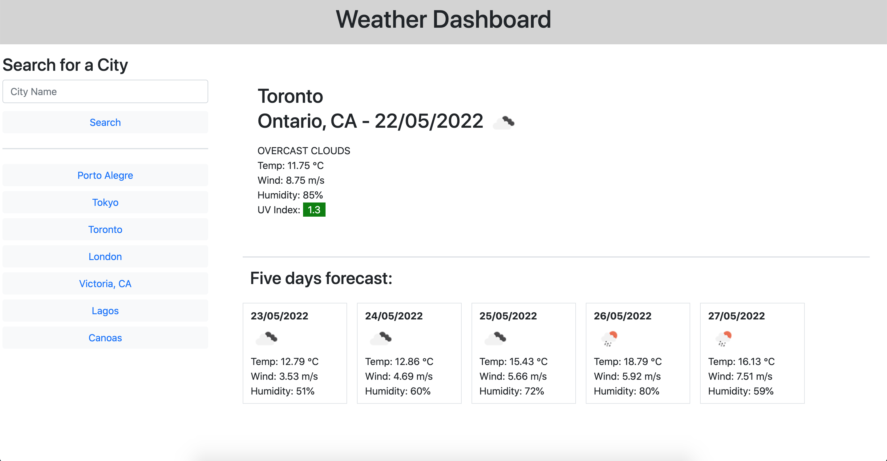

# weather-dashboard
Coding Bootcamp Weekly Challenge 6. This is a page to present current weather data and a five day forecast. It is developed Using HTML, CSS and JavaScript. The weather data is provided using the OpenWeather One Call API 1.0.

## About This Repository
This repository contains the working files for the Coding Bootcamp Weekly Challenge 6.  
The objective of this exercise is to demonstrate the hability to create websites featuring dinamically generated content by integrating the front end with an open API. The website basic structure was written in HTML. Javascript is used to create to fetch the API calls and return the content to be generated on the fly. The previous searches are saved to local storage for easy access to frequent used places.

## Website
https://leandromichelena.github.io/weather-dashboard/

## Page Screenshot

## Built With
* HTML
* CSS
* javascript

## Support
If you find any bugs or have any questions, please contact me on Github.

## Authors and Acknowledgment
HTML, CSS, and javascript created by Leandro Michelena.  
Weather data provided using the free Open Weather One Call API 1.0.  
Thanks for the Open Weather project for providing the data that makes this project viable.  

## License
MIT License
